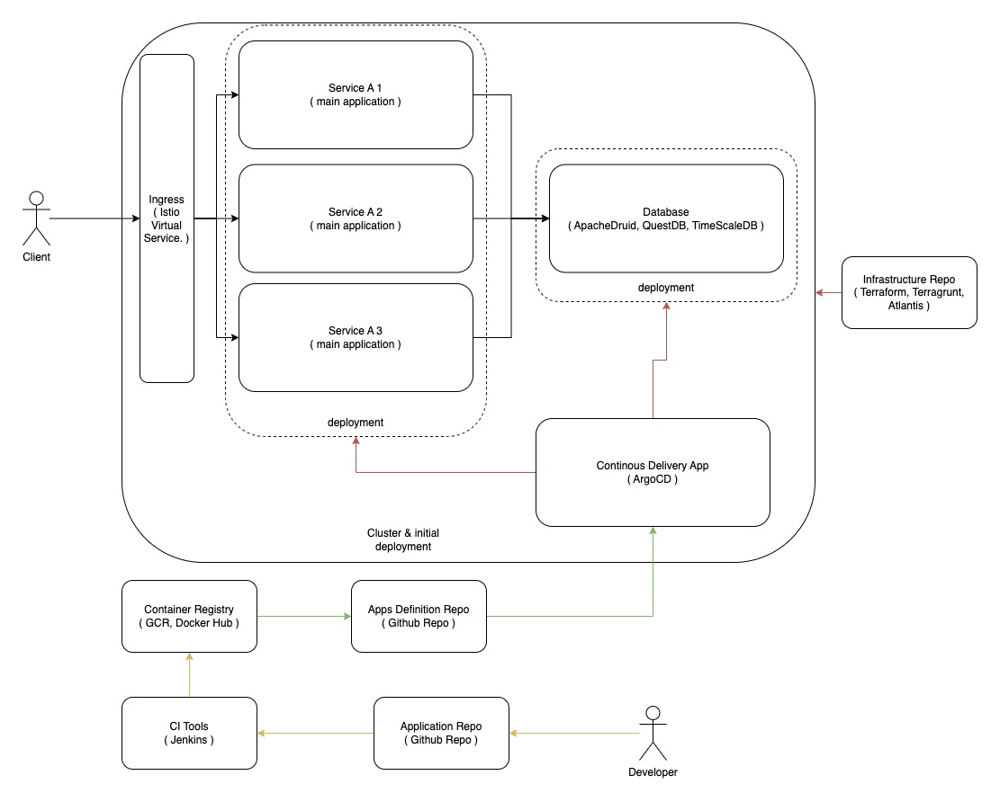
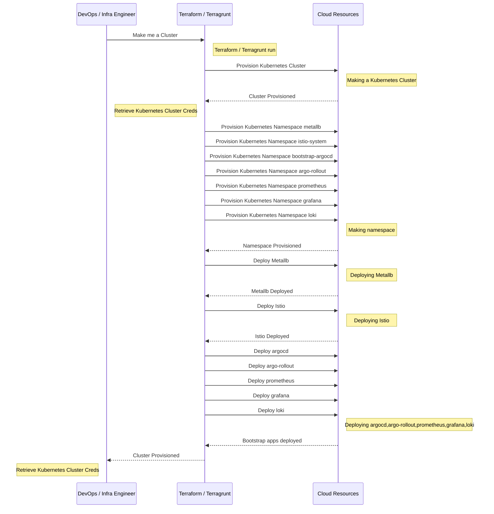

# Terraform Infra Resources

  
  

# What does this repository doing ?

**note : this sequence diagram is just showing for this golang main apps infrastructure needed, but can extend depends on what resource you use**

 

 

# Pre requirements
- Installed Terraform ( tested on `terraform 0.14.9` )
- Installed Terragrunt ( tested on `terragrunt 0.38.3` )
- Installed helm ( tested on `helm v3.7.1` )
- Installed istioctl ( tested on `istioctl 1.16` )

 
 

# Run it
- go to 'provision directory'
- run 'terragrunt run-all plan'
- run 'terragrunt run-all apply'

 
 

  

# How flexible is this repository ?

## 1. New Entity

*Let say Company spread their business into new subsidiary company, but the "infra" stuff still wants to be managed by existing Company's team, so here are the simple few steps*

- create new folder on `provision/live/{entity-name}`

- copy all of resource folder from another entity that new entity will use

## 3. Adding new Cloud Provider / resources

*Let say Company wants to explore new technologies for their business requirements and still wants to keep provisioning using Terraform*

- create new folder on modules/{provider-name}/{resource}

- create main.tf and var.tf and start build your TF modules

- start using it on `provision/live/{entity-name}/{resources}`

  
  

 

 

  

# Technology Stack

*1. API Gateway (Istio Gateway)*

Why do we need the traffic through an API Gateway ?,

- its for monitoring simplicity, we can measure latency of all service, error rate, and availability

- security purposes such as CORS enablement easily

  

---

  

*2. Kubernetes Sidecar Deployment*

Why do we need the sidecar container ?

- internal service rule

- distributed tracing

  

---

  

*3. Prometheus*

Why do we need Prometheus ?

- Extract metrics clusters metrics from the start

  

---

  

*4. Loki*

Why do we need Loki ?

- Aggregate the log clusters from the start

  

---

  

*5. Grafana*

Why do we need pgpool ?

- Centralized Monitoring Tools

  

 

# Internal Tools

*1. Terraform*

Why do we need terraform ?

- Infrastructure as a Code ( Easier maintenance )

- Tracking cloud usability

  
  

---

  
  

*2. Terragrunt*

Why do we need terragrunt ?

- Keep terraform base module DRY

  

---

  

*4. ArgoCD*

- Continous Delivery

- Canary

- Auto Sync GitOps

  

---

  

*5. Istio-System*

- Sidecar Container

- Distributed Monitoring